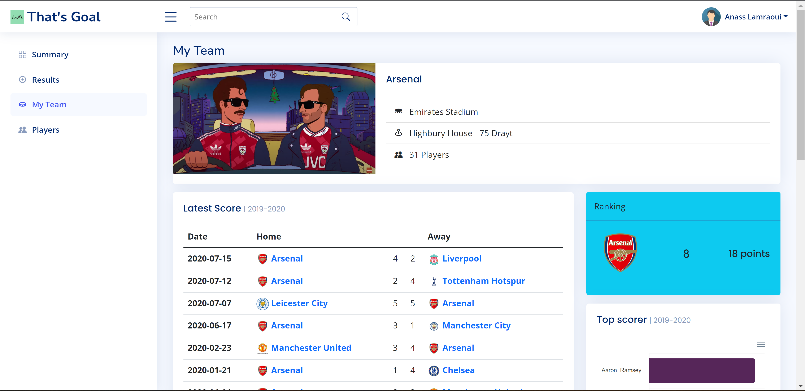

# Premier-league-dashboard

This project was made to create dahsboard in order to present analysis and insights to managers and club owners in the premier league.
The databse doesn't contain relevent answers instead it was a beta version to test the platform and the informations that could be provided by it.

In order to test the platform, it's necessary to run the php pages on a local server such as XAMP, and upload the database to MySQL Phpmyadmin.

In the website there's Four main pages for :
<ul>
  <li>Home page  </li>
  <li>Team page  </li>
  <li>Results page  </li>
  <li>Players page  </li>
  </ul>
